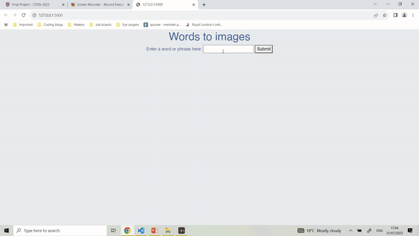

# Words to images

## Video demonstration
<https://youtu.be/a3iOdKi_deE>

## Description
This project is a web application created with Python in the Flask framework. The user inputs a word or sentence, and the program
converts that into an image, based on a value assigned to each letter. These values are then added together to provide a total.
The program has a range of images that is provided based on each value, i.e totals under 6 return the image of a cat. Characters that are not letters, including numbers, punctuation (specifically: "!" or "?" or "," or "." or ":" or ";" or "&") and spaces will be assigned the value zero. 

Points:
* a, e, i, o, u = 2 points
* b, j, k, q, v, x, y, z = 4 points
* c, d, f, g, h, l, m, n, p, r, s, t, w = 1 point

|Input|Process|Output|
|-----|-------|------|
|User enters their name 'Dave'|D = 1, A = 2, V = 4, E = 2 total = 9|Return image assigned to a value of 9, e.g a dog|
|User enters word 'cat'|C = 1, A = 2, T = 1 total = 4| Return images assigned to a value of 4, e.g a cat|

## Under the hood
This program was developed in the Python programming language using Flask, a web application framework designed for Python. I decided to use Flask as I want to focus on developing my skills in Python, which is a very popular programming language and relatively easy for person with less than a years developing experience. 

I also created tests using Unittest, a Python-specific testing framework, which you can see in the file called test_app.py. Testing, specifically test-driven development (TDD) was not mentioned in the CS50 course. However, after attending the Makers' bootcamp and applying for a few junior software development roles, I have learned how important testing is. In particular, testing may flag an error that is otherwise overlooked when the program initally works as expected, but may result in errors when performing outside of strict parameters, such as edge cases.

The frontend of the program uses HTML for formatting the layout of the page along with jinja, a web template developed for Python. CSS was used with the Bootstrap framework to style individual components of the application, such as font colour, font style and background colour.

Overall, the program is a simple yet effective example of a full stack application created using Python. 

## Requirements
As this is a web application, the user will not be required to download any specific software etc. However, they will need internet access via their device. The user will be required to input words comprised of the latin alphabet.

## What the program does
1. User opens web browser on their device
2. User goes to the web page
3. User inputs a word or phrase into the words form
4. The program assigns a number to each letter and adds the total together
5. The program scans the list of images, each of which are linked to a range of numbers i.e the cat image is for values under 6
6. The program finds the image that correlates to this particular value 
7. The program returns the image.

## Edge cases
The program only assigns values to letters from the latin alphabet. All other special characters, including punctuation and blank spaces, will be assigned the value of zero. If the user does not enter at least one letter, the program will return an error message, asking the user to input a word. The program will not be case sensitive.

## Contributions and thanks
Photos from Unsplash.com

Thanks to coffee, which has kept me going during my coding journey.
